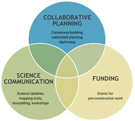
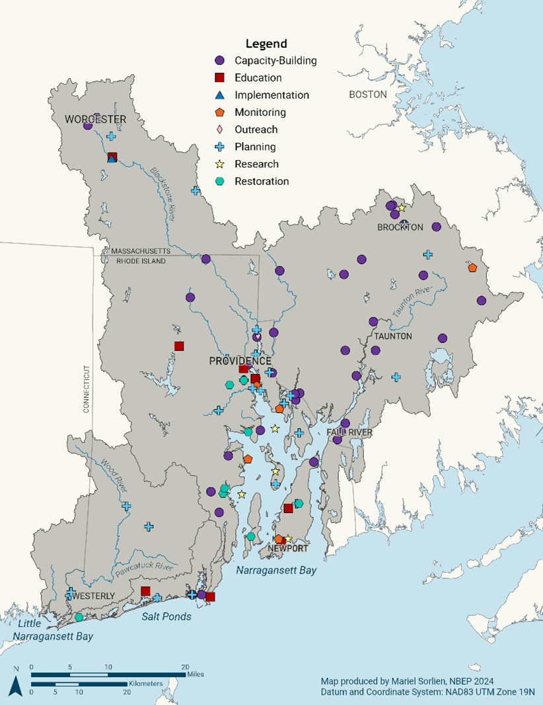

NBEP is a catalyst for scientific inquiry and collective action to restore and protect water quality, wildlife, and quality of life in the Narragansett Bay region, including Narragansett Bay, Little Narragansett Bay, the Coastal Salt Ponds, and their watersheds. NBEP envisions clean water and habitat to sustain all who live, work and play in the Narragansett Bay region. Hosted by Roger Williams University (RWU), with a staff of five and governed by a 28-member Steering Committee, NBEP is the only partner-led organization pursuing place-based conservation across the three-state Narragansett Bay region of Rhode Island, Massachusetts, and Connecticut.

NBEP was one of the first four estuaries to be included in the National Estuary Program (NEP), which is now 28 members strong. The NEP, administered by the Environmental Protection Agency (EPA), was created by Congress through 1987 Amendments to the federal Clean Water Act. The enabling legislation was drafted by late Rhode Island Senator John H. Chafee and other leaders in Congress to protect and restore “estuaries of national significance.” The NEP designation provided funding and structure for the nascent Narragansett Bay Program to publish the results and recommendations from seven years of intensive study of Narragansett Bay and its watershed as the first Comprehensive Conservation and Management Plan (CCMP) for Narragansett Bay (1992). The 1992 CCMP laid the groundwork for NBEP to operate as a locally-led, collaborative, non-regulatory program focused on protecting and restoring the water quality and ecological integrity of Narragansett Bay. NBEP is one of six NEPs with watersheds in New England. While NBEP engages with all NEPs, NBEP coordinates particularly closely with neighboring Buzzards Bay National Estuary Program and Long Island Sound Partnership due to small study area overlaps (2.8 square miles and 75.6 square miles, respectively). Staff carefully communicate with each other about funded projects and other work within the overlap areas to ensure appropriate levels of support across all communities within NEP regions.

# Management Conference

NBEP’s shared governance structure, consisting of dedicated staff and interns along with three volunteer Standing Committees, ensures that open discussion, cooperation, consensus-building, and collaborative decision-making among diverse partners advances the CCMP and mission.

Three Standing Committees—Steering Committee, Executive Committee, and Science Advisory Committee—include partners that represent the States in the region, the US Environmental Protection Agency (EPA) and other interested Federal agencies, local governments, interstate or regional entities, nonprofit conservation organizations, educational institutions, general public, and the host institution (Table 1). As NBEP’s host institution, Roger Williams University administers program funding and provides fiscal and program oversight. Each committee aspires to include a broad representation of interests that reflect the geographic, economic, and cultural diversity of the region.

-   **The Steering Committee** is NBEP’s primary governing body and assists the EPA, Host Institution, and NBEP Executive Director with setting the direction for NBEP. The Steering Committee of 28 members serves as a forum for open discussion, consensus building, and collaborative partner decision-making to advance implementation of the NBEP CCMP and mission.

-   **The Executive Committee** is a designated subset of eight members of the Steering Committee that offers counsel on major decisions facing the NBEP Executive Director, Steering Committee, or program.

-   **The Science Advisory Committee** provides a forum for NBEP and its partners to examine, discuss, synthesize, and share scientific findings to facilitate integration of science with management decisions, and offers guidance to ensure the scientific integrity of NBEP’s work.

**NBEP Standing Committee Members** (as of December 2025)

| Executive Committee |
|------------------------------------------------------------------------|
| **Chair** Caitlin Chaffee, Chief, Narragansett Bay National Estuarine Research Reserve |
| **Vice Chair** David Monti, Journalist, Recreational Fisherman, Charter Captain, No Fluke Fishing Charters |
| Richard Carey, Director, Watershed Planning Program, Massachusetts Department of Environmental Protection |
| Topher Hamblett, Executive Director, Save The Bay |
| Susan Kiernan, Administrator, Office of Water Resources, Rhode Island Department of Environmental Management |
| Regina Lyons, Chief, Ocean and Coastal Protection Section, U.S. Environmental Protection Agency – Region 1 |
| E. Heidi Ricci, Director of Policy and Advocacy, Mass Audubon |
| Peter Wong, Director, Office of Research and Sponsored Programs, Roger Williams University |

| Steering Committee (\*Executive Committee Member) |
|------------------------------------------------------------------------|
| **Chair** Caitlin Chaffee\*, Chief, Narragansett Bay National Estuarine Research Reserve |
| **Vice Chair** David Monti\*, Journalist, Recreational Fisherman, Charter Captain, No Fluke Fishing Charters |
| Molly Allard, District Manager, Northern Rhode Island Conservation District |
| Walter Berry, Representative, Rhode Island Rivers Council |
| Richard Carey\*, Director, Watershed Planning Program, Massachusetts Department of Environmental Protection |
| Peter Coffin, Coordinator, Blackstone River Coalition |
| Stefanie Covino, Executive Director, Blackstone Watershed Collaborative |
| Richard Friesner, Director of Water Quality Programs, New England Interstate Water Pollution Control Commission |
| Ben Greenstein, Public Member |
| David Gregg, Executive Director, Rhode Island Natural History Survey |
| Allison Hamel, Principal Environmental Scientist, Rhode Island Department of Transportation |
| Robert Johnston, Professor of Economics and Director, George Perkins Marsh Institute, Clark University |
| Cristina Kennedy, Coastal Wetlands Restoration Specialist, Massachusetts Department of Fish and Game, Division of Ecological Restoration |
| Susan Kiernan\*, Administrator, Office of Water Resources, Rhode Island Department of Environmental Management |
| Hillary King, Central Regional Coordinator, Municipal Vulnerability Preparedness Program, Massachusetts Executive Office of Energy and Environmental Affairs |
| Alicia Lehrer, Executive Director, Woonasquatucket River Watershed Council |
| Bruce Lofgren, Coastal Policy Analyst, Rhode Island Coastal Resources Management Council |
| Regina Lyons\*, Chief, Ocean and Coastal Protection Section, U.S. Environmental Protection Agency – Region 1 |
| Eliza Moore, Manager of Technical Analysis and Compliance, Narragansett Bay Commission |
| Bill Napolitano, Resilience and Sustainability Planner, Old Colony Planning Council |
| John O’Brien, Policy and Partnership Specialist, The Nature Conservancy in Rhode Island |
| E. Heidi Ricci\*, Director of Policy and Advocacy, Mass Audubon |
| Karla H. Sangrey, Engineer-Director/ Treasurer, Upper Blackstone Clean Water |
| Alicia Schaffner, Executive Director, Salt Ponds Coalition |
| Eric Schneider, Principal Marine Biologist, Rhode Island Department of Environmental Management, Division of Marine Fisheries |
| Stephen Silva, Volunteer Water Quality Monitoring Program Lead, Taunton River Watershed Alliance |
| Jed Thorp, Director of Advocacy, Save The Bay |
| Nate Vinhateiro, Science Director, University of Rhode Island – Coastal Institute |
| Caitlyn Whittle, Program Officer, U.S. Environmental Protection Agency – Region 1 |
| Peter Wong, Director, Office of Research and Sponsored Programs, Roger Williams University |

| **Science Advisory Committee** |
|------------------------------------------------------------------------|
| Catie Alves, South County Coast Keeper, Save The Bay |
| Michaela Cashman, Chemist, U.S. Environmental Protection Agency, Office of Research and Development, Atlantic Coastal Environmental Sciences Division |
| Sue Flint, Environmental Analyst, Watershed Planning Program, Massachusetts Department of Environmental Protection |
| Baylor Fox-Kemper, Professor of Earth, Environmental, and Planetary Sciences, Brown University |
| Robinson “Wally” Fulweiler, Professor, Boston University |
| Sara Grady, Senior Coastal Ecologist, Mass Audubon |
| Joseph Haberek, Administrator, Surface Water Protection and Water Quality, Office of Water Resources, Rhode Island Department of Environmental Management |
| Reza Hashemi, Assistant Professor, Department of Ocean Engineering and Graduate School of Oceanography, University of Rhode Island |
| Robert Johnston, Professor of Economics and Director, George Perkins Marsh Institute, Clark University |
| Heather Kinney, Coastal Restoration Scientist, The Nature Conservancy-Rhode Island |
| Anne Kuhn, Research Physical Scientist, U.S. Environmental Protection Agency, Office of Research and Development, Atlantic Coastal Environmental Sciences Division |
| Paul Mathisen, Associate Professor and Director of Sustainability, Department of Civil, Environmental, and Architectural Engineering, Worcester Polytechnic Institute |
| Kate Mulvaney, Social Scientist, U.S. Environmental Protection Agency, Office of Research and Development, Atlantic Coastal Environmental Sciences Division |
| Candace Oviatt, Professor of Oceanography, Director of the Marine Ecosystems Research Lab, Graduate School of Oceanography, University of Rhode Island |
| Danielle Perry, Marine Habitat Resource Specialist, National Oceanic and Atmospheric Administration |
| Warren Prell, Professor Emeritus of Oceanography, Department of Earth, Environmental, and Planetary Sciences, Brown University |
| Kenny Raposa, Research Coordinator, Narragansett Bay Estuarine Research Reserve |
| Kelly Streich, Environmental Scientist, Connecticut Department of Energy and Environmental Protection |
| David Taylor, Professor of Marine Biology, Feinstein School of Social and Natural Sciences, Roger Williams University |
| Alicia R. Timme-Laragy, Assistant Professor, School of Public Health and Health Sciences, University of Massachusetts – Amherst |
| Jamie Vaudrey, Associate Research Professor and Research Coordinator, University of Connecticut and Connecticut National Estuarine Research Reserve |

# NBEP’s Evolution

Over the past 10 years, NBEP intentionally built upon its identity as a funder of research and restoration to emerge as a more collaborative, interdisciplinary, and nimble body that provides a range of services and financial support to projects that respond to local needs and scientific findings across the Narragansett Bay region. To make this transition, NBEP leveraged partnerships to fully acknowledge issues and opportunities throughout the entire watershed and associated estuaries with a key focus on engagement with partners in Massachusetts. NBEP conducted deep relationship-building through hundreds of one-on-one meetings with new partners to expand participation in decision-making and understand how NBEP’s services could fill needs. Since 2018, NBEP’s Steering Committee has added new representation from fishing, health, transportation, non-governmental organizations, and the general public while retaining a nearly balanced membership across Rhode Island and Massachusetts. NBEP’s committee meetings, working groups, and funded projects function as collaboration hubs for these partners to work on common issues and opportunities outside of regular geopolitical, organizational, and cultural boundaries. As of the publication of this 2026 CCMP Revision, NBEP has solidified an organizational niche as a collaborative and partnership-based organization with a service-oriented and science-based approach to addressing complex environmental issues.

# NBEP’s Services

Guided by science and the shared will of the partnership, NBEP pursues lasting solutions to the region’s interrelated environmental challenges of urbanization, pollution, and a shifting baseline of environmental conditions to improve wildlife habitat and water quality. NBEP catalyzes collective action across geopolitical boundaries by providing collaborative planning services, science synthesis and communication tools, and project funding (@fig-services).

{#fig-services fig-alt="Venn diagram with three circles. Circle one: Collaborative planning. Consensus-building, watershed planning, diplomacy. Circle two: Science communication. Science updates, mapping tools, storytelling, workshops. Circle three: Funding. Grants for pre-construcation work."}

**NBEP's Guiding Principles**

-   Be bold and maximize sustainable benefits

-   Integrate and communicate best-available science for management decisions

-   Build regional collaboration as a neutral convener of varying perspectives

-   Secure and leverage the unique geopolitical identity of the Narragansett Bay region

-   Support locally-driven capacity and priorities

-   Focus on storytelling with people and places that demonstrate the importance of conservation

-   Be of service to partners

## Collaborative Planning

NBEP pursues independent convening, planning, and consensus-building among diverse groups of partners and communities to address shared issues and opportunities. Key examples of NBEP’s collaborative planning work include:

-   The *Blackstone Needs Assessment* project, in which NBEP convened Blackstone River Watershed interests to explore local needs, develop the Blackstone River Watershed Needs Assessment Report (NBEP 2021a), and establish a local coordinating organization to lead implementation of the report. As of this document’s publication, the Blackstone Watershed Collaborative is an independent nonprofit organization operating as an impact network to promote learning and coordinate action to solve complex watershed issues that no one organization could solve on its own. This work also provided a replicable model for creating the pre-conditions necessary to advance paired ecosystem and community health in other large and complex watersheds in the Narragansett Bay region.

-   The *Lower Blackstone Fish Passage Project*, in which NBEP led partners to reinvigorate progress on efforts to establish diadromous fish passage across four dams on the lower Blackstone River in Pawtucket, Rhode Island. In 2022, NBEP transitioned to a funder role and now supports the capacity of lead partners to continue convening, advocacy, and planning work on the largest fish passage project in the Narragansett Bay watershed with over \$500,000 of NBEP’s Infrastructure Investment and Jobs Act funds allocated to date.

-   Science Working Groups that convene partners to investigate and respond to ongoing and emerging topics, including:

    -   Salt Marsh Restoration, Assessment, and Monitoring Program (RAMP): Established in 2020 to formalize a decades-long cooperation between multiple federal, state, local, non-profit, and academic agencies to restore, assess, and monitor salt marshes throughout Rhode Island.

    -   Social Science Working Group: Established in 2020 to advance the integration of current social science into environmental decision-making in the Narragansett Bay region.

    -   Fishermen’s Ecological Knowledge Working Group: Established in 2021 to create a collaborative multidisciplinary team to assess how best to integrate fishermen’s observations into existing ecological monitoring frameworks.

    -   Seaweed Ecology and Assessment Collaborative (SEAC-RI): Established in 2024 to understand the role macroalgae plays in the ecosystem and how it impacts seagrasses, oyster beds, and other habitats throughout the region.

    -   Submerged Aquatic Vegetation Working Group: Established in 2020 and revitalized in 2025 to advance seagrass monitoring and restoration in Rhode Island waters.

    -   Coastal Urban Waters Research Collaborative: Established in 2024 to provide cross-state collaboration and coordination to understand ecosystem change in urban coastal waters informing resource management, resilience, and habitat improvement.

## Science Synthesis and Communication

NBEP provides scientific data analysis and communication using innovative storytelling and open-source web application tools to investigate complex socioenvironmental topics. NBEP serves as a hub for information-sharing tools such as:

-   2017 State of Narragansett Bay and its Watershed Report: This technical report, co-authored by NBEP and partners, describes 24 environmental and socioeconomic condition and stressor indicators that assess Narragansett Bay and its watershed (NBEP 2017). Since publication, NBEP has updated numerous indicators with more recent data, added new focus areas to existing indicators, and expanded indicators to cover the entire Narragansett Bay region to include the Rhode Island Coastal Ponds, Little Narragansett Bay, and their respective watersheds (See [Appendix A](appendix/appendix_a.qmd)).

-   A publicly-accessible GIS Data Hub that facilitates data-sharing and hosts interactive maps and StoryMaps to dive into complex topics, including:

    -   How Do We Use Our Coasts? StoryMap (NBEP 2021): NBEP, alongside partners at US EPA, used anonymized cell phone visitation data to assess usage of public coastal access sites.

    -   Hundred Acre Cove Septic Viewer and Stormwater Infrastructure Dashboard (Save The Bay 2021a): NBEP, in partnership with Save The Bay, created GIS tools to inform actions to better protect water quality in Hundred Acre Cove in the tidal Barrington River.

    -   Clean Water and Quahogs StoryMap (NBEP 2022): NBEP created an interactive tool to explain and celebrate the conditional opening of 1,900 acres of the lower Providence River for shellfishing for the first time in 75 years.

    -   Into the Woods: Solar in the Forest StoryMap (NBEP 2024): NBEP created a tool to visualize the number and location of ground-mounted solar projects in the Narragansett Bay region and assess how much undeveloped land has been lost to solar development across the region and at subwatershed scales.

-   Open-source data visualization tools:

    -   WQDashboard (2026): NBEP built a web tool using the Shiny application for R to enable local watershed groups to display water quality data on their websites. As of 2026, the tool has been adopted by the Blackstone River Coalition and the Salt Ponds Coalition.

    -   MarshMap (2025): At the request of the Salt Marsh RAMP Working Group, NBEP built a tool that displays information about salt marsh restoration and monitoring projects in Rhode Island.

## Project Funding

NBEP provides watershed project funding that helps build a pipeline of future projects that restore and sustain the natural environment. Funding supports research, staff capacity, and project planning steps, including studies, assessments, and engineering design. NBEP’s far-reaching outreach to partners between 2019–2021 identified a lack of local capacity in state agencies, municipalities, and non-governmental organizations as the single biggest barrier to new project development in the Narragansett Bay region. In response, NBEP developed a nine-step Project Development Process (@fig-project-development) that aims to communicate the importance of often-underfunded pre-project development steps, from engagement to design and planning. As a result of this outreach and the significant influx of Infrastructure and Jobs Act funds beginning in 2022, NBEP cemented its niche as a funder of pre-construction engagement and planning. While the sunset of Infrastructure Investment and Jobs Act funds will impact NBEP’s ability to support project development, this CCMP Revision lays the foundation for work to secure alternative sustainable funding sources.

{#fig-project-development fig-alt="Project development process. Arrow with nine steps. Labels above arrow: 1 is education, 2 through 5 is selection, 6 through 8 is design and planning, and 9 is implementation. Arrow steps: 1 engagement, 2 problem identifcation, 3 solution development, 4 partner committment, 5 grant writing and management, 6 study and assessment, 7 conceptual design, 8 final design and permitting, 9 construciton. Step 1 and 5, engagement and grant writing, can take place across all steps of project development."}

Since 2019, NBEP has granted over \$5 million to priority restoration, research, and community engagement projects (@fig-funding-map), including:

-   Green Infrastructure Grants (2021, 2022): NBEP awarded \$953,988 in §320 funds for stormwater planning projects that align natural and engineering processes to improve water quality and reduce flooding while offering a range of co-benefits, including resilience to increasing rainfall intensity, wildlife habitat, public health, and other socioeconomic and community enhancements.

-   Capacity-Building Grants (2022, 2023): NBEP awarded over \$1 million in §320 and Infrastructure Investment and Jobs Act funds to support staff capacity within seven partner organizations. To date, recipients have more than doubled the amount awarded to them by NBEP in additional grant leverage. The early results of this grant program demonstrate the power of supporting people and organizations that already have relationships and agency to push projects forward.

-   Habitat Restoration and Public Access Grants (2023): NBEP awarded \$748,822 in Infrastructure Investment and Jobs Act funds for seven planning projects to improve watershed habitats and public access to those habitats. Project benefits include improving marsh resilience and creating more waterfront public recreational access points while restoring coastal habitat and improving flood resilience. Grants help fund the critical early pre-construction phases of project planning and design.

-   Public Outreach and Education Grants (2021–2025): NBEP awarded \$167,086 in §320 funds for eleven outreach and education projects seeking to meaningfully involve watershed residents in restoration. From school programs, to work-force development, to volunteer programs and boater outreach, these grants help partners directly educate and engage the public on key watershed issues.

-   Aquatic Habitat Connectivity Grants (2022, 2024, 2025): NBEP awarded over \$2.25 million in Infrastructure Investment and Jobs Act funds for capacity-building and planning projects that seek to remove barriers to aquatic organism passage, including dam removals, culvert upgrades, and fish passage structures. These projects help support important fisheries and better protect communities from flooding.

{#fig-funding-map fig-alt="A map of projects funded by NBEP from 2012 to 2024. Categories include Capacity-Building, Education, Implementation, Monitoring, Outreach, Planning, Research, and Restoration. Capacity-building is the most common category."}
