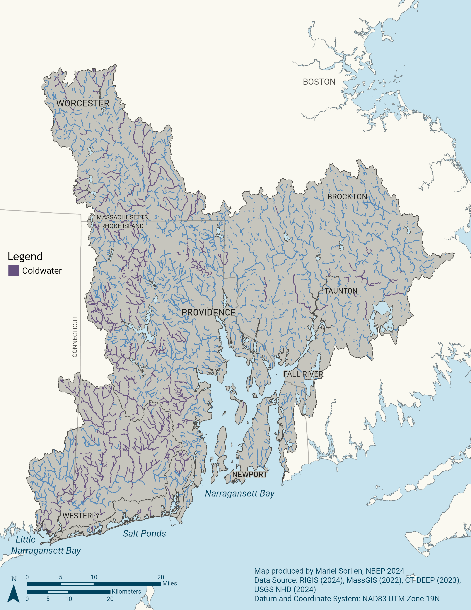
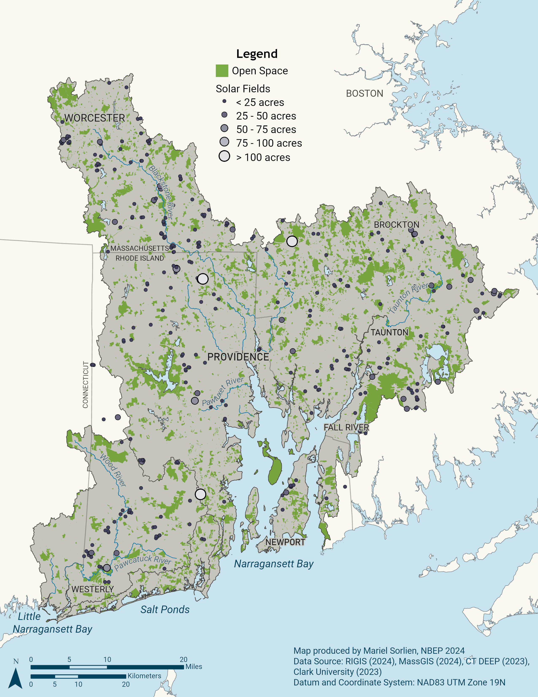
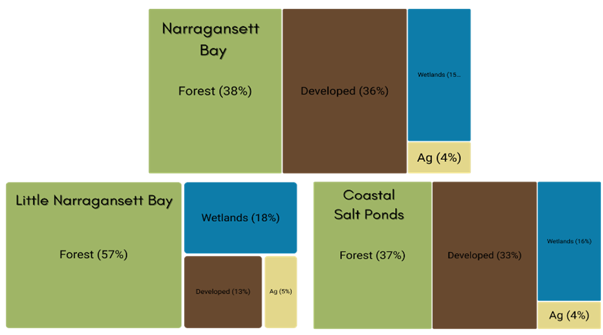

+----------------------------------+--------------------------------------------------------------------------------------------------------------------------------------------------------------------------------------------------------------------+
| **Vision**                       | Resilient and connected landscapes and waterways support healthy habitats and wildlife and provide people with ecosystem services like clean air and water, flood protection, recreation, and sustainable harvest. |
+----------------------------------+--------------------------------------------------------------------------------------------------------------------------------------------------------------------------------------------------------------------+
| **Goal**                         | Restore and protect habitats that support wildlife and people.                                                                                                                                                     |
+----------------------------------+--------------------------------------------------------------------------------------------------------------------------------------------------------------------------------------------------------------------+

# Priority Opportunities and Challenges

The Narragansett Bay region, situated in three of the most densely populated states in the nation, is a mosaic of urban and suburban communities surrounded by forested landscapes and a network of rivers and streams. The American Industrial Revolution, which began at Slater Mill on the Blackstone River in the heart of the region over 200 years ago, left a legacy of fragmented habitats and contaminated sediments that remains a heavy influence on human quality of life. Today, extreme weather events interact with legacy problems and ongoing urbanization to create challenging present and future conditions. Yet people and nature persist, and opportunities abound to advance a collective vision of resilient and connected landscapes, waterways, and people.

Habitat conditions vary greatly across the Narragansett Bay region with estuary and watershed conditions generally improving with distance from urban areas. Historically, ecosystems have been fragmented and fish and wildlife migration corridors disconnected by infrastructure built to accommodate the growing human population and industry of the region. More recent suburban sprawl encroaches and impacts forests and coastal wetlands. Changes in precipitation patterns, warming air and water temperatures, and coastal flooding and storms are also degrading habitats.

When ecosystems lose integrity through fragmentation and degradation, they lose their ability to provide essential functions for protecting wildlife, water quality, human well-being, and the regional economy. Across 13 key economic sectors that rely on the Narragansett Bay watershed’s natural capital, an estimated \$14 billion in combined revenue and expenditures was at stake in 2016. Tourism contributed 73 percent of the total [@uchida2019].

## Estuarine Habitats

Since European contact, the region has lost more than half of its salt marshes and seagrasses to pollution, development, and higher sea levels. Roughly 4,300 acres of salt marsh habitat and 875 acres of seagrass habitat remain in the region [@nbep2017; @nbep2023b]. While historic seagrass losses resulted mostly from development and disease, ongoing seagrass losses—and lack of restoration successes—are driven by warmer waters and nutrient pollution that accelerate algal growth and reduce the availability of sunlight necessary for seagrass survival. There is an opportunity to galvanize regional efforts to restore seagrass habitat in the region’s estuaries (Action: [Habitats-2.3](habitat/action_2_3.qmd)).

Since the early 1900s, industrialization, increased pollution, and the loss of seagrass caused a shift in shellfish communities from scallops to quahogs, which tend to be found in softer sediments. Today, the quahog is Rhode Island’s official state shellfish, and quahogging is a treasured local pastime. Overfishing of wild oysters, observed as early as colonial times, and pollution linked to early 1900’s industrialization led to declines in natural oyster reefs. With cleaner waters and aquaculture lease management regulations, oyster aquaculture today is a valuable fishery [@rice2006].

In 2018, the University of Rhode Island completed a third bay-wide survey of benthic habitat quality, advancing a 30-year time series during a time of decreasing nutrient inputs. Results showed improvements in benthic habitats bay-wide, but with less improvement in the bay’s uppermost Providence and Seekonk Rivers, Greenwich Bay system, and Allen Harbor, which are closest to pollution sources [@shumchenia2019]. NBEP provided funding for the project and developed a StoryMap that describes this complex work [@nbep2020c]. In general, there is a need for additional monitoring and modeling of benthic habitat dynamics (such as macroalgae, wild oysters, and infauna) to advance conservation and restoration (Actions: [People-2.2](people/action_2_2.qmd) and [Habitat-1.1](habitat/action_1_1.qmd)).

Critical salt marsh habitat is under threat throughout the Narragansett Bay region from higher sea levels and altered hydrology from legacy agriculture and development, which drive salt marsh deterioration and fragmentation by accelerating erosion and subsidence and outpacing salt marsh accretion. Salt marsh subsidence (especially at creekbanks) is also linked to increased nutrients as added nitrate decreases belowground root growth that leads to soil destabilization [@deegan2012]. Many marshes show signs of plant die-off, erosion, and other stresses [@august2019]. The coastline is now less resilient to storms and floods due to the loss of salt marsh. Without action, most of RI’s remaining coastal wetlands will be displaced or destroyed by the end of this century [@crmc2015]. The saltmarsh sparrow, which only lives and breeds in salt marshes, is currently under review by the US Fish and Wildlife Service for protection as an endangered species. The need is urgent to identify and preserve salt marsh migration corridors and sustain marshes in place (Action: [Habitats-3.2](habitat/action_3_2.qmd)).

Salt marsh restoration practitioners are working to buy time for these vulnerable habitats. For example, Save The Bay has pioneered a technique to restore the hydrology of marshes impacted by human impacts from agricultural uses and mosquito ditching through digging shallow creeks or runnels and maintaining a select number of ditch features to facilitate gradual water drainage of impounded water off the marsh surface [@savethebay2021b]. Impounded water causes vegetation, particularly plants that are adapted to dry conditions at low tide, to become stressed and die, resulting in the marsh surface subsiding. Practitioners also place sediment to elevate degraded marshes to make them more resilient to sea level rise. Both techniques aim to sustain salt marshes and their dependent wildlife species, such as the vulnerable saltmarsh sparrow, in place while conservation of adjacent uplands aims to preserve areas for future inland marsh migration. NBEP supports these and other ongoing salt marsh restoration and monitoring projects with funding and technical assistance through convening the Salt Marsh Restoration, Assessment, and Monitoring Program (RAMP), a cooperation among multiple federal, state, local, non-profit, and academic agencies to restore, assess, and monitor salt marshes throughout Rhode Island.

::: {.callout-note collapse="false"}
### Succotash Marsh Sediment Placement and Sentinel Site Monitoring

Succotash Marsh, a 182-acre salt-marsh system located within Potters and Point Judith Ponds in South Kingstown, Rhode Island, provides an array of habitats that support a wide assemblage of birds, including threatened salt marsh sparrows, as well as commercial aquaculture and recreational opportunities. Sea level rise threatens Succotash Marsh by subjecting it to more frequent flooding, and surrounding development prevents the marsh from migrating upland. This project, led by the Narragansett Bay Estuarine Research Reserve, will complete the planning and design phases of a sediment placement project to improve the resilience of Succotash Marsh and establish a monitoring plan that includes pre-restoration monitoring at both the project site and a control site.
:::

## Freshwater Habitats

The Narragansett Bay region has over 4,000 miles of rivers and streams and 40,000 acres of lakes and ponds. However, many freshwater habitats are impacted by nutrient enrichment, low dissolved oxygen, or other parameters [@nbep2017].

The region’s industrial past has left thousands of dams, impoundments, and other barriers that reduce the connections between freshwater and saltwater systems. There are about 1,000 dams and many times that number of culverts in the Narragansett Bay region. These barriers may not only increase flood risk with increased precipitation, warm waters, and create slow-moving impoundments that harbor invasive aquatic plants, but many also block migration for important diadromous fish populations. By one estimate, every mile of river opened to fish passage can contribute more than \$500,000 in economic and social benefits [@usfws2011].

{#fig-habitat-coldwater fig-alt="Map of coldwater streams in the Narragansett Bay region. Coldwater streams are in purple, all other streams are in blue."}

Regional partners have worked diligently and successfully to remove barriers to aquatic organism passage on the Narragansett Bay region’s two Wild and Scenic River networks, the Taunton and the Wood-Pawcatuck (see @nte-habitat-fishpassage), as well as on coastal rivers and streams throughout the region. Despite progress, many opportunities remain to capitalize on historic investments to restore and improve freshwater-saltwater connectivity for fish passage, flood resiliency, habitat restoration, and recreation, especially where deteriorating infrastructure can be removed or redesigned for multiple ecological, economic, and social co-benefits. Progress on these complex projects can be accelerated with proactive and collaborative decision-making (Actions: [Habitats-2.1](habitat/action_2_1.qmd) and [Habitat-2.2](habitat/action_2_2.qmd)).

For example, while water quality in the Blackstone River has dramatically improved, significant barriers to fish passage remain. The Lower Blackstone Fish Passage Project aims to reinvigorate progress on establishing diadromous fish passage across four dams on the lower Blackstone River in Pawtucket, RI. Fish passage past the four dams would deliver a wide range of important benefits, including opening 206 acres of spawning nursery habitat, generating over 200,000 adult spawning river herring and 10,000 adult spawning shad per year, creating forage fish for commercial species in the bay, improving connectivity for other species, and enabling greater recreational and cultural enjoyment. NBEP led partners to evaluate past efforts, convene workshops, and conduct interviews and mediation among 22 diverse partners to maximize benefits to ecosystems, hydropower, and heritage. In 2022, NBEP transitioned to a funder role and now supports the capacity of lead partners and a newly-formed Community Advisory Committee to continue convening, advocacy, and planning work on the largest fish passage project in the Narragansett Bay watershed, with over \$500,000 of Infrastructure Investment and Jobs Act and Section 320 funds allocated by NBEP to date.

::: {#nte-habitat-fishpassage .callout-note collapse="false"}
### Pawcatuck River Fish Passage Projects

Nearly all 34 miles of the Pawcatuck River are open for fish passage for diadromous species such as American shad, alewife, blueback herring, and American eels thanks to several projects constructed over the last fifteen years. Fishways have been completed at Kenyon Mill Dam (Richmond, RI 2013), Upper Shannock/Horseshoe Falls (Richmond, RI 2012), and the Bradford Dam (Bradford, RI 2017). The Lower Shannock Falls Dam (Richmond, RI 2010) and the White Rock Dam (Westerly, RI and Stonington, CT 2015) have been removed.

In 2024, the Town of Westerly and partners won funding from NOAA to implement fish passage or dam removal at the Potter Hill Dam, the last fish passage barrier on the mainstem of the Pawcatuck River. The work will provide access to more than 3,000 acres of spawning habitat and 120 miles of stream habitat for river herring and other migratory fish.

Looking to headwater streams, in 2022, NBEP provided IIJA funds to the Wood-Pawcatuck Watershed Association (WPWA) to develop a cold-water stream restoration plan. WPWA completed the plan in 2024 and now seeks to implement the eight highest-priority projects identified in the plan.
:::

## Upland Habitats

The Narragansett Bay region encompasses more than one million acres. About 200,000 acres are protected open space, including natural, agricultural, and recreational lands. More than 260,000 acres in the watershed have been identified as high ecological value, but 185,000 acres of these natural lands remain unprotected as of NBEP’s last regional assessment (Chapter 21 in @nbep2017). Coastal basins are the most urbanized, ranging from 65 to 85 percent urban lands. Impacts to forests are accelerating as suburban sprawl encroaches. For example, between 2001–2011, the Upper- and Middle-Taunton River Basins lost nine percent and 18 percent of their forest lands, respectively, to new development [@nbep2017]. Clear-cutting forests to build ground-mounted solar photovoltaic arrays is a growing concern, but there are opportunities to develop and implement land use policies to advance and balance habitat and floodplain protection as well as clean energy and housing needs [@fig-habitat-solar; @manion2023]. Development pressure points to the urgent need to proactively protect remaining lands with high ecological integrity.

{#fig-habitat-solar fig-alt="Map of protected open space and solar arrays in the Narragnasett Bay region. Most of the solar arrays are less than 25 acres, but three of the solar arrays are larger than 100 acres."}

{#fig-habitat-landuse fig-alt="Three charts showing land use in Narragansett Bay, Little Narragansett Bay, and the Coastal Salt Ponds respectively. Narragansett Bay is 38% forest, 36% developed, 15% Wetlands, and 4% agriculture. Little Narragansett Bay is 57% forest, 18% wetlands, 13% Developed, adn 5% agriculture. The coastal salt ponds are 37% forest, 33% developed, 16% wetlands, and 4% agriculture."}

## Resiliency Considerations

Higher sea levels and more intense precipitation and storm surge events will create additional challenges for protecting and restoring natural habitats in the Narragansett Bay region. Restoration and habitat protection plans must continue to prioritize long-term ecosystem adaptation and resilience under changing conditions, rather than simply restoring habitats to some prior state. Understandings of changing environmental conditions must be incorporated into restoration project prioritization, design, implementation, and maintenance. For example, because sea level rise is driving salt marsh deterioration and fragmentation by accelerating and outpacing salt marsh accretion, conservation of upland migration corridors will be necessary for marsh migration.

Warming water temperatures have reduced the number of cold-water river species and have impacted viability of estuarine fish and shellfish communities. Moreover, invasive species are establishing new ranges and outcompeting natives—changing the species compositions and ecosystem services of key estuarine and watershed habitats. Fisheries managers, in particular, will need access to up-to-date data and analyses to be adaptive to new-to-the-region species. Dams, impoundments, culverts, altered streams, and other infrastructure are increasingly vulnerable under altered hydrologic regimes associated with rising sea levels and more intense precipitation and storm surge events that cause flooding. Restoring habitat connectivity for diadromous species provides refuge, increased reproductive opportunity, and resilience to changing water temperature, salinity, and pH.

# Habitat Protection and Restoration Objectives and Actions

Protecting and restoring priority habitats in this Action Plan requires creating and updating restoration plans, implementing restoration projects to improve resilience and connectivity, and protecting existing natural lands through land use policy and acquisition. These efforts require coordinated planning and implementation across multiple geographical scales and political boundaries. Success also requires outreach to local conservation groups and municipalities to support staff capacity and share best practices.

+----------------------------------------------------------------------------+--------------------------------------------------------------------------------------------------------------------------------------------------------------------------------------------------+
| **Objectives**                                                             | **Actions**                                                                                                                                                                                      |
+----------------------------------------------------------------------------+--------------------------------------------------------------------------------------------------------------------------------------------------------------------------------------------------+
| Habitat-1. Improve collection and use of habitat data for decision-making. | *Biodiversity and Habitat Quality Monitoring:* Support, improve, and create efficiencies for monitoring and documenting biodiversity and habitat quality.                                        |
+----------------------------------------------------------------------------+--------------------------------------------------------------------------------------------------------------------------------------------------------------------------------------------------+
| Habitat-2. Improve habitat resilience                                      | *Habitat Plans*: Update existing and develop new regional habitat restoration plans and strategies to facilitate cross-boundary projects and address emerging challenges for habitat resilience. |
|                                                                            |                                                                                                                                                                                                  |
|                                                                            | *Habitat Projects:* Identify, prioritize, and coordinate partner opportunities and funding to implement habitat restoration projects*.*                                                          |
|                                                                            |                                                                                                                                                                                                  |
|                                                                            | *Benthic Habitat Assessment and Restoration*: Assess and restore benthic habitats to support dynamic estuarine ecosystems.                                                                       |
+----------------------------------------------------------------------------+--------------------------------------------------------------------------------------------------------------------------------------------------------------------------------------------------+
| Habitat-3. Restore habitat connectivity and function                       | *Aquatic Connectivity*: Reconnect freshwater and saltwater systems and improve connectivity within freshwater systems to restore habitats and fisheries.                                         |
|                                                                            |                                                                                                                                                                                                  |
|                                                                            | *Salt Marsh Restoration*: Restore coastal wetlands and reconnect with uplands for habitat migration, wildlife, and recreation.                                                                   |
+----------------------------------------------------------------------------+--------------------------------------------------------------------------------------------------------------------------------------------------------------------------------------------------+
