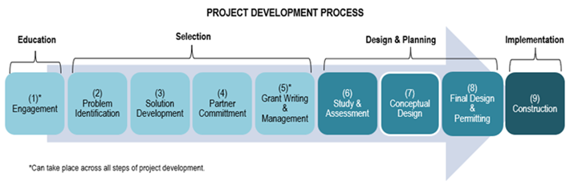

::: {.callout-note}
# Full Action Statement

Develop the NBEP Finance Plan to catalyze fundraising and investments for projects that implement the CCMP.
:::

# Action Description and Statement of Need

This Action calls NBEP to lead development of a Finance Plan to 1) ensure NBEP secures sufficient funding to provide its core services, 2) guide NBEP’s funding decisions on a five to ten-year timescale, and 3) convene efforts to increase funding for priority restoration projects.

In addition to consistent funding through the National Estuary Program, watershed protection efforts in the Narragansett Bay region benefit from an EPA geographic program (the Southeast New England Program (SNEP)) and state funding for conservation, restoration, and resilience projects. Infrastructure Investment and Jobs Act dollars allocated to NBEP and partners between 2022–2025 have provided essential support for staff capacity, project development, and project implementation.

Since 2022, NBEP’s staff has grown from two to five full-time employees. This growth has enabled NBEP to increase and diversify services that it provides to partners and other organizations, including convening, science communication, and project funding. With the recent hires of two new positions, Watershed Outreach Manager and Staff Ecologist, NBEP anticipates further diversifying its services to include direct outreach and habitat project implementation. The NBEP Finance Plan will seek to balance NBEP’s internal operations requirements with external subawards and contracts to support CCMP implementation.

Due to realized and anticipated reductions in federal investments in conservation efforts over early implementation of this CCMP Revision, it is important for NBEP to develop a targeted strategy for granting subawards and contracts. NBEP will work closely with partners during development of the Finance Plan to identify the highest-priority projects in this CCMP Revision to pursue with external awards within the framework of NBEP’s nine-step Project Development Process (@fig-project-development).

{#fig-project-development fig-alt="Project development process. Arrow with nine steps. Labels above arrow: 1 is education, 2 through 5 is selection, 6 through 8 is design and planning, and 9 is implementation. Arrow steps: 1 engagement, 2 problem identifcation, 3 solution development, 4 partner committment, 5 grant writing and management, 6 study and assessment, 7 conceptual design, 8 final design and permitting, 9 construciton. Step 1 and 5, engagement and grant writing, can take place across all steps of project development."}

Despite decades of consistent—and in recent years, increased—federal and state financial support for restoration, project funding remains insufficient. The Narragansett Bay region receives roughly one-fifth of the federal dollars per square mile that are received to support comparable project needs in Chesapeake Bay, Puget Sound, Long Island Sound, and Lake Champlain regions. Through development and implementation of its Finance Plan and Engagement Plan (Action: [People-1.1](action_1_1.qmd)), NBEP will convene partners to seek additional funding for water quality and habitat restoration.

# Potential Projects

-   Convene partners to identify the highest-priority projects in this CCMP Revision to pursue with external awards within the framework of NBEP’s nine-step Project Development Process.

-   Develop an NBEP Finance Plan and seek approval by the Steering Committee and EPA Region 1.

-   Solicit and award funding for staffing, planning, design, and construction of water quality, habitat, and public access projects.

# Outputs

-   NBEP Finance Plan

-   NBEP project funding solicitations

-   NBEP project awards

-   Funded planning and construction projects

# Outcomes

-   Increased collaborative and strategic fundraising

-   Increased awareness of the cost, value, and importance of conservation, restoration, and resilience efforts in the Narragansett Bay region

-   Increased regional staff capacity for project planning, development, implementation, and maintenance

-   Increased number of conservation, restoration, and resilience projects in the region

-   Improved ecosystem and community health and resilience

# Indicators

All indicators

# NBEP role

Convene, Fund capacity and projects

# Implementing Partners

Steering Committee

# Location

Narragansett Bay region

# Timeline for initiation

2026

# Estimated costs/potential funding sources

\$10K–500K

NBEP 320/SNEP
