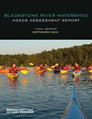
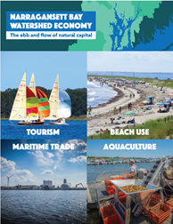

+-------------+--------------------------------------------------------------------------------+
| **Vision**  | Informed and engaged partners are empowered to implement the CCMP.             |
+-------------+--------------------------------------------------------------------------------+
| **Goal**    | Provide foundational knowledge, capacity, and drivers for CCMP implementation. |
+-------------+--------------------------------------------------------------------------------+

# Priority Opportunities and Challenges

As a catalyst for scientific inquiry and collective action, NBEP provides foundational knowledge, capacity, and drivers for people to act. NBEP fulfills its roles by convening partners, synthesizing and communicating science, funding capacity and projects, and voicing support across three objectives to advance engagement, information and tracking, and regional cooperation.

## Engagement

Implementation of the NBEP CCMP requires informed, engaged, and empowered partners contributing collectively to shared goals. NBEP will build on its track record as a neutral convener and “honest broker” by developing a regional Engagement Plan to prioritize and focus NBEP’s engagement with partners and priority audiences (Action: [People-1.1](people/action_1_1.qmd)).

::: {.callout-info collapse="false"}
### Public Engagement Highlight: Blackstone River Watershed Needs Assessment Report

{fig-alt="Blackstone River Watershed Needs Assessment Report" fig-align="center"}

NBEP convened a broad group of Blackstone River Watershed interests between 2019 and 2021 to explore local needs. The resulting Blackstone River Watershed Needs Assessment Report (NBEP 2021a) describes high-priority needs and 20 recommended actions. The first recommendation in the assessment, creation of the Blackstone Watershed Collaborative and hiring of a manager to oversee it, was accomplished in 2021 with NBEP funding. The Blackstone Watershed Collaborative has to date leveraged over \$1M in other funding sources to continue its operation and support of small organizations. This project enabled the Blackstone River to join Narragansett Bay’s other major tributary, the Taunton River, in having an up-to-date plan and coordinating organization to lead its implementation.
:::

## Information and Tracking

NBEP consistently tracks and reports on the status and trends of ecological conditions of greatest concern for management and public interest. Monitoring, research, data synthesis, and modeling are necessary to ensure that NBEP’s reporting is based on the best available science.

In 2024, NBEP and partners developed a Research Plan to coordinate and foster research necessary to better understand ecosystem change, improve aquatic habitats, and advance work on environmental indicators. Implementation of the NBEP Research Plan (Action: [People-1.2](people/action_1_2.qmd)) will increase information and understanding to inform, guide, and evaluate management actions. Advancing and increasing use of integrated ecosystem data synthesis and modeling tools (Action: [People-2.2](people/action_2_2.qmd)) will better equip scientists and managers to make decisions and better understand the complex interactions between water quality, ecosystems, and socioeconomic indicators.

In 2003, NBEP and partners developed a suite of environmental indicators for Narragansett Bay and its watershed (NBEP 2003). In 2017, the list was reviewed and expanded to 24 stressor and condition indicators that underlie ecosystem and socioeconomic health (NBEP 2017). Since then, indicators have been updated with new data and focus areas ([Appendix A](appendix/appendix_a.qmd)). There is a continued need to refine and improve metrics of existing indicators and develop new environmental and socioeconomic indicators to address priority management issues that may arise (Action: [People-2.3](people/action_2_3.qmd)).

NBEP strives to communicate effectively with partners and the broader interested public by developing accurate, understandable, and accessible science communication products for different user groups (Action: [People-2.1](people/action_2_1.qmd)). Data visualizations and dashboards are effective tools to display information about environmental status and trends. Narrative stories, GIS StoryMaps, and digestible fact sheets also translate complex science for broad readership and encourage further inquiry. Information provided in clear, accessible formats can assist resource managers, non-governmental organizations, decision-makers, and others to better understand stressors affecting ecosystem health and to identify how environmental conditions are changing and impacting communities. These communications are foundational for building public support for action and informing management decisions, including strategic investment in protection and restoration.

::: {.callout-info collapse="false"}
### Information and Tracking Highlight: Narragansett Bay Watershed Economy Report

{fig-alt="Narragansett Bay Watershed Economy. The ebb and flow of natural capital. Tourism. Becah use. Maritime Trade. Aquaculture." fig-align="center"}

The Narragansett Bay Watershed Economy Report (Uchida et al. 2019) was a collaborative effort that identified 13 key sectors that rely on the watershed’s natural capital and the cumulative economic impact of those sectors (\$14B, 2016 dollars).
:::

## Regional Cooperation

The Narragansett Bay region requires more funding for conservation, restoration, and resilience projects—and more staff capacity for project development and maintenance—to implement CCMP goals and objectives. Development of the NBEP Finance Plan will ensure NBEP secures sufficient funding to provide its core services and increase funding for CCMP priority projects within the framework of its nine-step Project Development Process (Action: [People-3.1](people/action_3_1.qmd)).

Once the status and trends of key environmental and socioeconomic indicators are determined, the community must reach consensus on measurable targets for those indicators that equate to a desired future condition (Action: [People-3.2](people/action_3_2.qmd)).

::: {.callout-info collapse="false"}
### Governance Highlight: Massachusetts Division of Ecological Restoration Expansion

{fig-alt="Commonwealth of Massachusetts Division of Ecological Restoration. Invested in Nature and Community." fig-align="center"}

The Massachusetts Division of Ecological Restoration (MA DER) was established in 2009 as part of the Massachusetts Department of Fish and Game under the Executive Office of Energy and Environmental Affairs to bring attention, momentum, and capacity to river and wetland restoration. Since then, MA DER and partners have completed more than 160 restoration projects, with over 80 active projects currently underway. Today, MA DER operates three branches (Capacity Building, Habitat Restoration, and Technical Services) and multiple funding programs that support local organizations and project development to improve habitat, reduce flooding, and improve water quality and public safety.
:::

## Resiliency Considerations

Higher sea levels, warmer water temperatures, and more intense precipitation and storm surge events will create additional challenges for managing natural, built, and socioeconomic systems in the Narragansett Bay region. Empowering partners and communities with the agency and tools to engage on issues related to regional vulnerability, adaptation, and mitigation are key to expanding resilience. Actions in the People Ready to Act Action Plan develop tools designed to empower partners and communities to take proactive action, advocate for decisions, understand the latest science, and identify management strategies that sustain multiple benefits across various time scales and uncertainties.

# People Ready to Act Objectives and Actions

Providing foundational knowledge, capacity, and drivers for people to act is central to building capacity within the region to protect and restore water and habitat quality, fish and wildlife, and quality of life. The People Ready to Act Action Plan incorporates a suite of interconnected actions to improve regional knowledge, coordination, effectiveness, and capacity to better protect and restore the Narragansett Bay region.

+--------------------------------------------------------------------------------------------------------------+-----------------------------------------------------------------------------------------------------------------------------------------------------------------------+
| Objectives                                                                                                   | Actions                                                                                                                                                               |
+==============================================================================================================+=======================================================================================================================================================================+
| People-1. Increase meaningful and useful partner and public engagement.                                      | *Engagement Plan:* Develop and Implement the NBEP Engagement Plan to convene and activate partners to implement priority CCMP Actions                                 |
|                                                                                                              |                                                                                                                                                                       |
|                                                                                                              | *Research Plan*: Implement the NBEP Research Plan and Coastal Urban Waters Research Collaborative.                                                                    |
+--------------------------------------------------------------------------------------------------------------+-----------------------------------------------------------------------------------------------------------------------------------------------------------------------+
| People-2. Improve access to and use of information to improve ecosystem management and public understanding. | *Science Communication Tools*: Develop compelling open-source data visualizations, stories, and dashboards.                                                           |
|                                                                                                              |                                                                                                                                                                       |
|                                                                                                              | *Ecosystem Modeling:* Support, improve, and create efficiencies for integrated ecosystem models and decision-support tools that foster effective resource management. |
|                                                                                                              |                                                                                                                                                                       |
|                                                                                                              | *Indicators*: Develop and update indicators to track environmental and socioeconomic trends.                                                                          |
+--------------------------------------------------------------------------------------------------------------+-----------------------------------------------------------------------------------------------------------------------------------------------------------------------+
| People-3. Accelerate CCMP implementation by supporting efforts to increase regional cooperation.             | *Finance Plan*: Develop the NBEP Finance Plan to catalyze fundraising and investments for projects that implement the CCMP.                                           |
|                                                                                                              |                                                                                                                                                                       |
|                                                                                                              | *Regional Targets*: Establish shared regional ecosystem targets with public reporting systems to track progress.                                                      |
+--------------------------------------------------------------------------------------------------------------+-----------------------------------------------------------------------------------------------------------------------------------------------------------------------+
