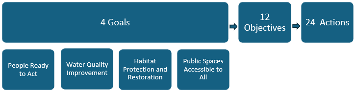

This 2026 Revision to the Comprehensive Conservation and Management Plan (CCMP) for the Narragansett Bay region is a ten-year blueprint for collaborative action among partners of the Narragansett Bay Estuary Program (NBEP) to sustain and restore Narragansett Bay, Little Narragansett Bay, the Coastal Salt Ponds, and their watersheds in Rhode Island (RI), Massachusetts (MA), and Connecticut (CT), hereafter “Narragansett Bay region.” The estuaries, rivers, streams, and watersheds of the Narragansett Bay region are home to diverse and vibrant habitats, wildlife, and human communities. This CCMP Revision aims to build upon conservation successes while addressing legacy and emerging threats to this beautiful landscape and its inhabitants.

NBEP is a catalyst for scientific inquiry and collective action to investigate, document, restore, and protect water quality, wildlife, and quality of life in the Narragansett Bay region. Since NBEP’s last CCMP Update (NBEP 2012), NBEP has intentionally broadened its geographic and organizational focus to emerge as a partnership-based, service-oriented organization rooted in science and dedicated to action throughout the 2,000 square mile Narragansett Bay region. The 113 actions in the 2012 CCMP have been consolidated into 24 priority opportunities for collaborative work. All 24 Actions arose from an intensive five-year period of input from NBEP committee members and other partners. Each Action has been carefully considered through four strategic lenses: regionalism, connectivity, resiliency, and fairness. In highlighting these strategic lenses, NBEP strives to acknowledge and center the Narragansett Bay region’s long, shared history of industrialization and habitat fragmentation that set the stage for current challenges. At the same time, NBEP looks to the strategic lenses for inspiration to rightfully restore a landscape that has provided so much to its residents, and to capitalize on the region’s strengths and opportunities to shape a lasting future for our water, wildlife, and ways of life.

{fig-alt="Flowchart. 4 goals to 12 objectives to 24 actions. There are four items listed under goals: 1 people ready to act, 2 water quality improvement, 3 habitat protection and restoration, 4 public spaces available to all."}

# Acknowledgements

The Narragansett Bay Estuary Program Steering, Executive, and Science Advisory Committees provide invaluable guidance, energy, and expertise for all collaborative endeavors, including this CCMP Revision. Thank you.

NBEP Staff (2026): Danielle Moore, Jennifer Rogers, Mariel Sorlien, Courtney Schmidt, and Darcy Young.

Thank you to the former NBEP staff members who shaped the process of this CCMP Revision: Julia Bancroft, Mike Gerel, and Julia Twichell.

Facilitators: Coastwise Partners

Writers and Editors: Shafer Consulting, LLC
