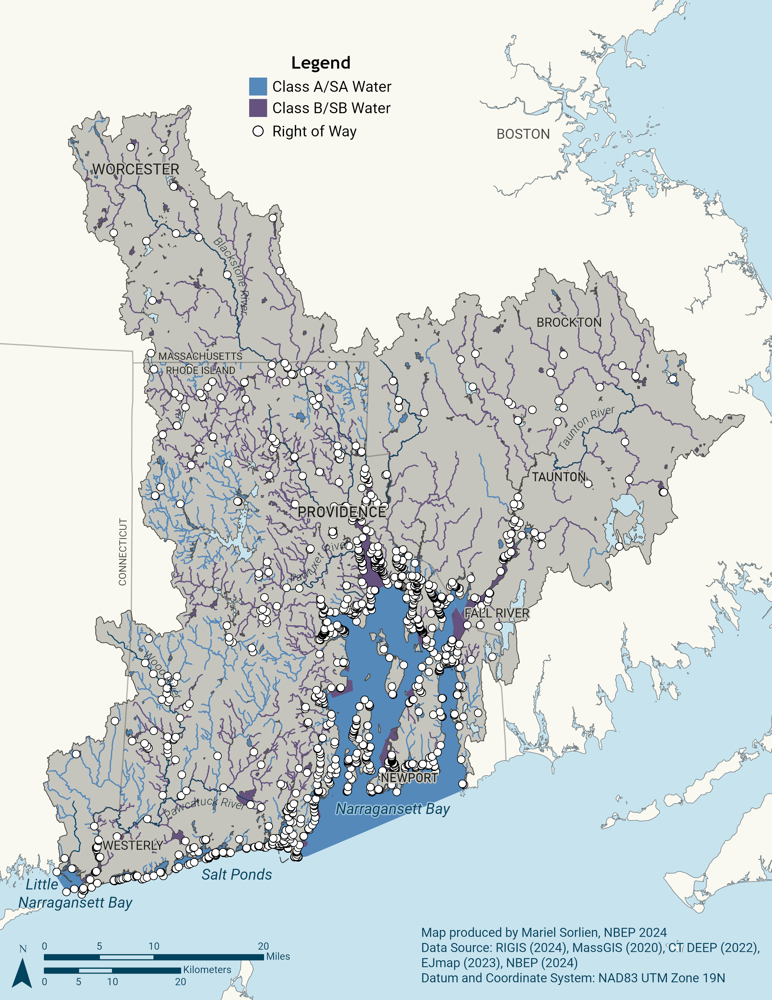
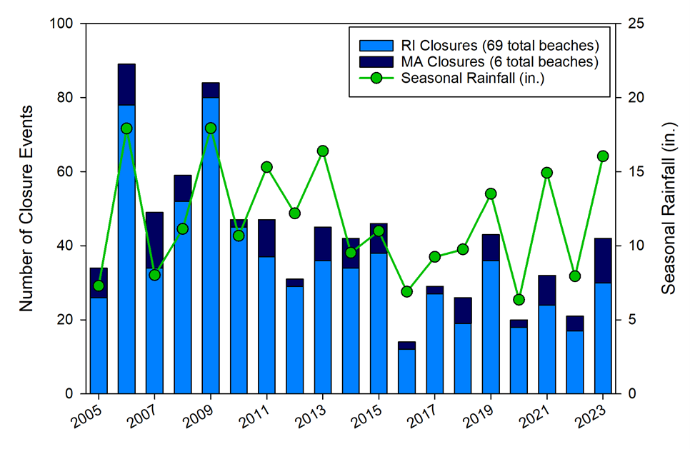

+---------------------+--------------------------------------------------------------------------+
| **Vision**          | All communities can enjoy their right to safe, quality access to nature. |
+---------------------+--------------------------------------------------------------------------+
| **Goal**            | Ensure all communities realize long-term benefits of healthy watersheds. |
+---------------------+--------------------------------------------------------------------------+

## Priority Opportunities and Challenges

Surveys, public bonds, and spending habits repeatedly show that quality access to nature is a priority for residents and visitors alike. Visits to natural areas by residents and tourists generate billions of dollars and support hundreds of thousands of jobs [@uchida2019]. Safe access to nature supports health and wellbeing by providing recreational, cultural, and aesthetic amenities. At the same time, it is important to plan and manage access responsibly to avoid negatively impacting these special places.

::: {.callout-note collapse="false"}
### Public Support for Conservation Financing

Over the last decade, public support for financing environmental improvement remains strong across the region. Rhode Island’s first Green Bond was approved by voters in 2016, showing overwhelming public support for investments in water quality, land cleanup, farmland, recreational facilities, open space, and resiliency. Since 2016, Rhode Island voters have approved four bond series totaling \$206.3 million for a wide variety of environmental projects. In Massachusetts, the Community Preservation Act (CPA) of 2000 allows communities to conduct a referendum to add a small surcharge on local property taxes. When combined with matching funds from the statewide Community Preservation Trust Fund, this dedicated fund is used to build and rehabilitate parks, playgrounds, and recreational fields, protect open space, support local affordable housing development, and preserve historic buildings and resources. Altogether, 196 Massachusetts cities and towns, including 41 in the Narragansett Bay region, have adopted CPA.
:::

### Public Access

The identity of the Narragansett Bay region is shaped by its thousands of miles of rivers and streams and hundreds of miles of salty coastline where hundreds of coastal boat launches, docks, marinas, beaches, rights-of-way, overlooks, and fishing points provide public access [@nbep2021f]. The region also offers an extensive mosaic of forests, parks, preserves, trails, campgrounds, and bikeways. Over 200,000 acres are protected as federal and state parks, wildlife management/conservation areas, and privately protected preserves all open to the public. Thousands of municipal parks, neighborhood pocket parks and playgrounds, ball fields, and urban green spaces add to public outdoor recreational opportunities. Yet, there remain opportunities to close gaps in regional accessibility to high quality experiences [@twichell2022] (Action: [Public Spaces-1.1](public_spaces/action_1_1.qmd)).

{#fig-public-spaces-row fig-alt="Map of impaired water and public rights of way in the Narragansett Bay region."}

New access points should be strategically located to reduce disparities in travel time, transportation, parking availability, safety, and mobility (@fig-public-spaces-row) (Action: [Public Spaces-1.1](public_spaces/action_1_1.qmd)). Resilience to storms, responsiveness to carrying capacity, and funding models for long-term maintenance also need to be prioritized in plans and projects to improve access points. Further clarifying the public’s legal rights to access points and ensuring those rights are understood and protected will also help ensure fair access (Action: [Public Spaces-1.2](public_spaces/action_1_2.qmd)).

### Public Health

The region is home to over 140 licensed freshwater and marine beaches [@nbep2014]. Additionally, 100,000 acres of estuarine waters are fully or conditionally approved for shellfish harvesting with 3,700 acres opened since 2017 [@nbep2022]. Water quality improvements in the region’s estuaries and rivers have led to safer conditions for recreation (@fig-public-spaces-row), yet public health challenges remain, particularly in freshwater systems and urban areas, where excess nutrients and increasing temperatures drive toxic cyanobacteria blooms.

Episodic events, including storms and combined sewer overflows, can render waterways unsafe, requiring temporary closures of saltwater beaches, freshwater access points, and shellfish harvest areas. Contaminated water and shellfish can produce gastrointestinal stress in people, with severe consequences for those who are young elderly, or immunocompromised. Further, legacy contamination like mercury and polychlorinated biphenyls (PCBs) threatens the health of people who regularly consume finfish they catch [@taylor2017]. There are opportunities to better protect public health by continuous improvements to notification systems in the event of sewer overflows, harmful algal blooms, or unsafe fish and shellfish harvest (Action: [Public Spaces-2.1](public_spaces/action_2_1.qmd)).

::: {.callout-note collapse="false"}
#### Reductions in Marine Beach Closures

{#fig-public-spaces-beach-closure fig-alt="Stacked bar plot with Rhode Island and Massachusetts beach closures in blue and dark blue respectively. X-axis is number of closure events, range 0 to 100. Y-axis is year, range 2005 to 2025. Seasonal rainfall is plotted as a green line on top of the graph. Secondary y-axis is seasonal rainfall in inches, range 0 to 25. Number of beach closures and seasonal rainfall are generally correlated."}

Beach closures negatively impact quality of life and tourism. Closures are closely linked to rainfall, as stormwater runoff is a significant source of bacteria to many beaches. Sources of bacteria include discharges of raw sewage from combined sewer overflows (CSOs), failing septic systems, cesspools, and wild and domestic animals. Decades of work to reduce stormwater and wastewater impacts and improve water quality at marine beaches throughout the region has resulted in a notable decrease in beach closures since 2006. However, precipitation models predict a trend of increasingly intense precipitation events that are likely to overwhelm existing infrastructure and contribute to additional beach closures. Additional work is needed to implement solutions that account for future rainfall scenarios, especially in the region’s new urban beaches, which are particularly vulnerable to polluted stormwater runoff.
:::

### Resiliency Considerations

Higher sea levels, warmer water temperatures, and more intense precipitation and storm surge events will create additional challenges for providing safe public access to natural areas supporting recreational, cultural, health, and aesthetic uses in the Narragansett Bay region. Warmer water temperatures can increase growth rates of harmful algal blooms, waterborne bacteria and viruses, and aquatic invasive plants, all of which can impede water-based recreation. Intensified precipitation events, in the absence of continued wastewater and stormwater treatment capacity upgrades, may lead to increased polluted discharges and associated recreational and shellfishing closures. Increased public health risks associated with these changes will require additional management and communication efforts. Beaches, riverbanks, lakeshores, and water access infrastructure—like boat launches, piers, and coastal trails—are vulnerable to erosion or total loss due to sea level rise and more intense precipitation and storm surge events. The public’s right to access the tidal shoreline is also at risk when rising tides put the public’s share of the shoreline in conflict with private property or a hardened shoreline. Plans and projects to help maintain and expand access to waterways and natural areas must account for loss of existing access while adopting resilient designs for new and improved access.

## Public Spaces Accessible to All Objectives and Actions

This Public Spaces Accessible to All Action Plan focuses attention on multiple fronts: protecting legal access rights, maintaining long-term funding streams for site management, ensuring quality opportunities, and alerting the public about potential exposure to environmental health risks in recreational waters, as well as their role in curbing the environmental pollutants that can exacerbate those risks. This ensures all communities realize the benefits of healthy watersheds, while protecting the environmental integrity of public lands and waters.

+----------------------------------------------------------------------------+---------------------------------------------------------------------------------------------------------------------------------------------------------------------------+
| **Objectives**                                                             | **Actions**                                                                                                                                                               |
+----------------------------------------------------------------------------+---------------------------------------------------------------------------------------------------------------------------------------------------------------------------+
| Public Spaces-1. Increase managed public access to nature.                 | *New Public Access*: Assess, prioritize, and support plans and projects to expand public access to waterways, natural areas, and urban green spaces.                      |
|                                                                            |                                                                                                                                                                           |
|                                                                            | *Public Access Protection*: Develop policies and awareness campaigns to clarify and ensure legal access to shorelines and inland waterways.                               |
|                                                                            |                                                                                                                                                                           |
|                                                                            | *Public Access Management*: Support long-term management and stewardship of parks and public access points through community engagement, policy change, and job creation. |
+----------------------------------------------------------------------------+---------------------------------------------------------------------------------------------------------------------------------------------------------------------------+
| Public Spaces-2. Improve communication about environmental health hazards. | *Environmental Health Alerts*: Develop and publicize education campaigns and public alert and incident reporting systems for environmental health risks.                  |
+----------------------------------------------------------------------------+---------------------------------------------------------------------------------------------------------------------------------------------------------------------------+
