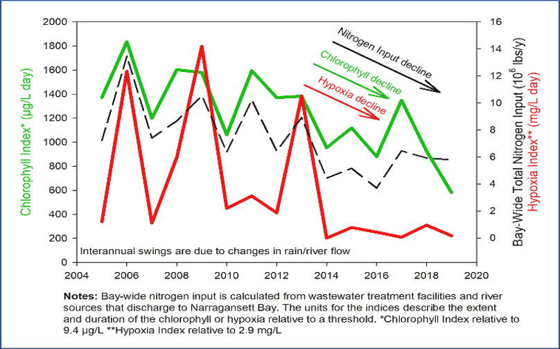
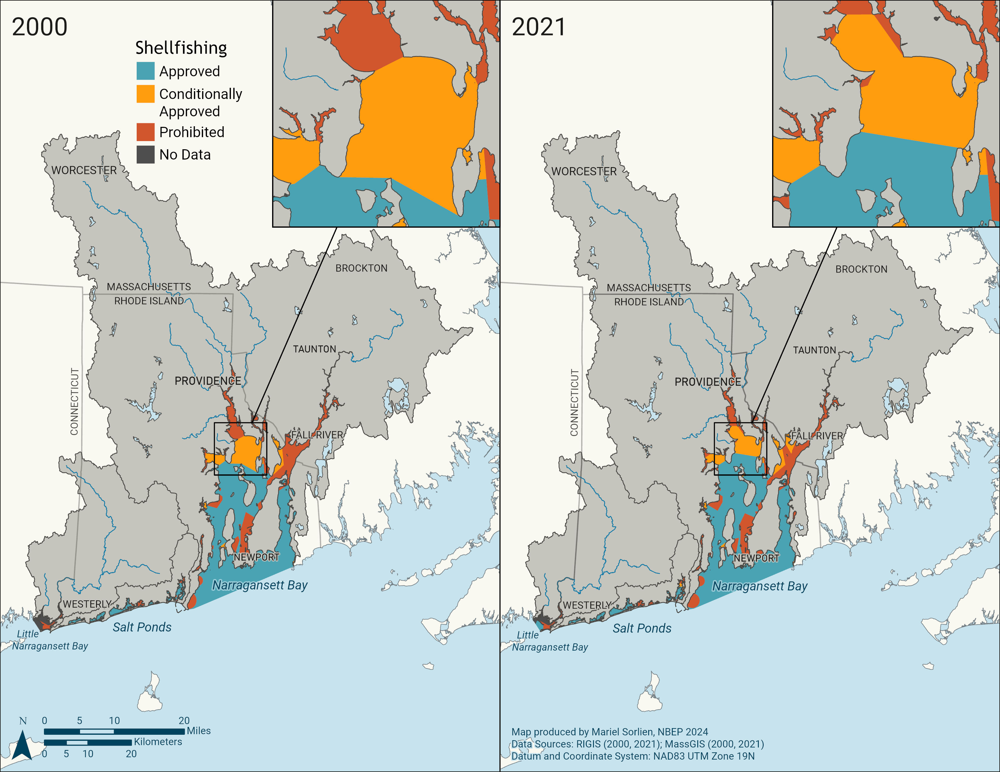
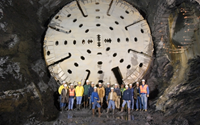
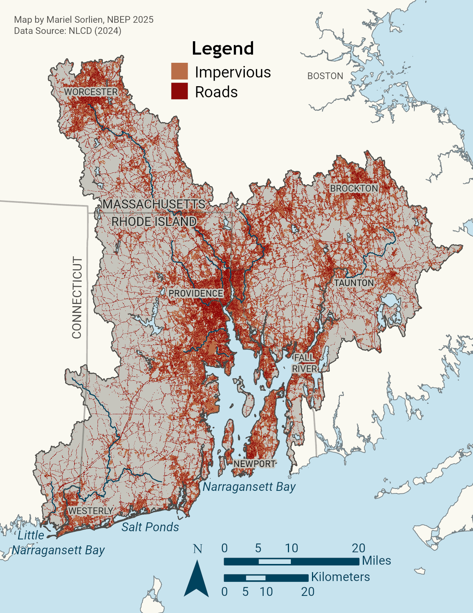
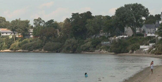
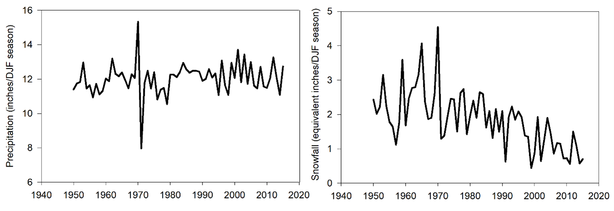
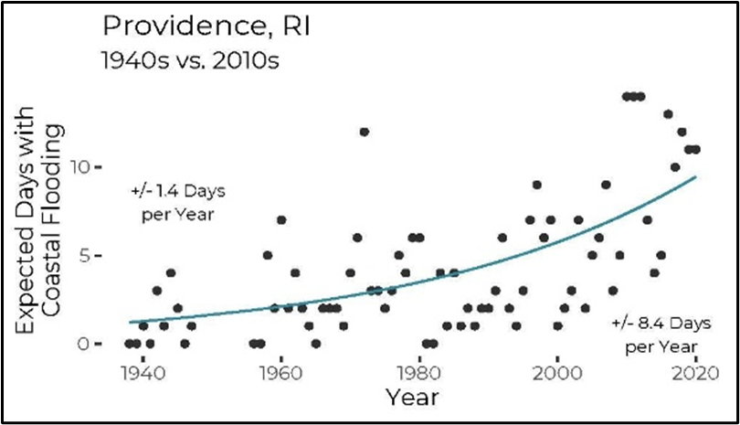

+----------------------+--------------------------------------------------------------------------------------------------------------------------------------------------------------------------------------------------------+
| **Vision**           | Waters support healthy ecosystems and communities by meeting their designated uses, including healthy fish and wildlife habitat, drinking water supply, fishing, shellfish harvesting, and recreation. |
+----------------------+--------------------------------------------------------------------------------------------------------------------------------------------------------------------------------------------------------+
| **Goal**             | Improve water quality to support healthy ecosystems and communities.                                                                                                                                   |
+----------------------+--------------------------------------------------------------------------------------------------------------------------------------------------------------------------------------------------------+

# Priority Opportunities and Challenges

Water quality in Narragansett Bay has improved since 2000. Between 2000–2012, summer nitrogen loadings to Narragansett Bay were reduced by 50 percent due to upgrades to nutrient treatment capacity at Rhode Island and Massachusetts wastewater treatment facilities (WWTFs) that discharge into the upper Narragansett Bay region (RIDEM 2024b). Between 2016–2021, nitrogen loads were reduced by 70–76 percent when compared to pre-nitrogen reduction efforts in the early 2000s.

{#fig-water-hypoxia fig-alt="Graph. X-axis shows years, from 2004 to 2020. Y-axis has three variables at different scales: chlorophyll index (ug/L day), bay-wide total nitrogen input (10^6 pounds/year), and hypoxia index (mg/L day). Graph shows interannual swings due to changes in rain/river flow, but an overall trend of decreased nitrogen input, chlorophyll, and hypoxia. Notes: Bay-wide nitrogen input is calculated from wastewater treatment facilities and river sources that discharge in Narragansett Bay. The units for the indices describe the extent and duration of the chlorophyll or hypoxia relative to a threshold. Chlorophyll Index is relative to 9.4 ug/L. Hypoxia Inex is relative to 2.9 mg/L."}

Decreased nutrient loading from wastewater discharges were associated with reductions in chlorophyll-*a* (excess phytoplankton) and hypoxia (low dissolved oxygen) in the bay (NBEP 2020a, NBEP 2020b, NBEP 2021b) (@fig-water-hypoxia). A more recent analysis of Bay water quality has shown a reduction in the average number of hypoxic days at most stations, excluding the Seekonk River (RIDEM 2024b). Additionally, the Blackstone River was delisted in 2022 for impairments related to low dissolved oxygen.

These favorable trends coincide with a decades-long trend of declining chlorophyll-*a*, driven by increasing bay water temperatures and water column stratification that limits nutrient flux to surface waters (Thibodeau *et al.* 2024). Gains have predominantly been made through management actions to reduce nutrient and pathogen pollution from combined sewer overflows, WWTFs, and onsite wastewater treatment and disposal systems (OWTDS).

{#fig-water-shellfish fig-alt="Side by side maps of shellfish harvesting restrictions in 2000 and 2021. There are three categories: blue is approved, orange is conditionally approved, and red is prohibited. The upper bay has a larger portion of prohibited and conditionally approved areas than the lower bay. An inset on each map shows the Providence River. A large portion of the Providence River that was conditionally open in 2000 is open in 2021. Additionally, some of the area that was prohibited is now conditionally approved."}

Reduced pathogen pollution has supported the recovery of consumable shellfish harvesting areas in the lower Providence River (@fig-water-shellfish). In 2021, about 1,900 acres of the lower Providence River were conditionally opened to shellfish harvest after 75 years of closure. Water quality improvements from upgrades to WWTFs, urban stormwater retrofitting with redevelopment and new development, and the completion of the Phase One and Two Providence, Pawtucket, and Central Falls Combined Sewer Overflow underground tunnel capture system (see Callout) allowed these new conditionally approved shellfish harvest areas to open to the public. In 2025, the Rhode Island Department of Environmental Management (RIDEM) announced that rain-related shellfish closures have reduced from seven to six days for the Lower Providence River and Greenwich Bay shellfish conditional areas due to further water quality improvements.

While these and other transformative water quality successes have been achieved, many challenges remain. Nonpoint source pollution continues to degrade area waters with pathogens and nutrients, which negatively impacts shellfish harvesting and recreational uses. Elevated pathogens are the most common cause of impairment in the region’s rivers and streams, while low dissolved oxygen is the most common cause in estuarine waters. Across the region, securing sustainable financing for installing and maintaining stormwater best practices remains difficult. Maintaining sewer systems by replacing and upgrading aged and broken infrastructure is similarly taxing. Other pressing water quality management concerns include emerging contaminants, per- and polyfluoroalkyl substances (PFAS), and mercury in fish tissue. Rising sea levels and intensification of precipitation events and storms will interact with and exacerbate the negative effects of anthropogenic stressors on water quality in the Narragansett Bay region, risking the improvements described herein.

::: {.callout-info collapse="false"}
## Water Quality Improvement Highlight: Restored Waters RI

{fig-alt="Construction workers standing in the massive underground stormwater tunnel under Providence." fig-align="center"}

In 2001, the Narragansett Bay Commission (NBC) started construction on a massive infrastructure project, Restored Waters RI, to build underground tunnels to capture and store stormwater and prevent combined sewer overflows during heavy rainfall. The project also includes green infrastructure, such as rain gardens, that capture stormwater at the surface, and advanced wastewater treatment upgrades, like UV disinfection. The first two phases of the project, a three-mile tunnel under the City of Providence and a network of ancillary pipes, were completed in 2008 and 2015. Together, the Phase One and Two tunnel and pipes capture more than 50% of the combined sewage flows that would have otherwise drained into the Providence River. The third and final stage of the project is a 2.2-mile-long storage tunnel through Pawtucket, Central Falls, and East Providence. Drilling for the tunnel was completed in 2024, and work continues to connect piping, pump stations, and shafts. When complete, the tunnel will store and transport storm-related combined sewer and storm water overflow to Bucklin Point Wastewater Treatment Facility for full treatment before being discharged to Narragansett Bay. NBC predicts that when Phase III is complete, there will be a 93% decrease in storm-related discharge to the Seekonk River.
:::

## Stormwater

Untreated stormwater discharges are widespread and a major pollution concern in the Narragansett Bay region. They degrade water and habitat quality and prompt beach and shellfish harvesting area closures (RIDEM 2024b). In addition to nutrient pollution, stormwater conveys sediments, bacteria and viruses, oil and grease, metals, and trash. In addition, there is growing public concern and management attention to issues associated with pharmaceuticals, microplastics and especially “forever chemical” per- and polyfluoroalkyl substances (PFAS) in stormwater. Impacts of these pollutants on the environment and public health are not fully understood and continue to be studied while management programs undertake initial actions to prevent and mitigate their impacts.

{#fig-water-impervious fig-alt="Map of the Narragansett Bay region showing impervious cover in dark orange and roads in red. Impervious cover is most dense in urban areas such as Providence, Worcester, Fall River, and Westerly."}

About 14 percent of the Narragansett Bay Watershed land cover is comprised of impervious surfaces (NBEP 2017). These areas increase the volume and velocity of stormwater runoff carrying pollutants into surface waters. Impervious cover rises to a level of concern for water quality impacts when it reaches about 10%, although research has also shown impacts below that benchmark in certain situations (CWP 2003). Impervious cover is expected to increase with population growth and development. In Rhode Island’s urban cores of Providence, Pawtucket, and Central Falls, over 60 percent of the land area is impervious (RIDEM 2024a). Already, stormwater discharges have been implicated as significant sources of nutrient and bacterial pollution in a majority of TMDLs in Rhode Island (RIDEM 2024b) and the Blackstone, Taunton, and Narragansett Bay Coastal watersheds in Massachusetts (MassDEP 2024). Increasing stormwater pollution, both in volume and pollutants, will result in more flooding, erosion, sedimentation, water quality degradation, low dissolved oxygen, habitat modification and loss, and impacts to human health.

The Narragansett Bay region must embrace strategies to prevent additional pollution from new and re-development (Actions: [Water-1.2](water/action_1_2.qmd) and [Water-2.1](water/action_2_1.qmd)). Many watersheds would further benefit from more effective stormwater management to retrofit urbanized landscapes that were built without effective stormwater treatment (Action: [Water-2.2](water/action_2_2.qmd)). Municipalities bear much of the responsibility for implementing these Actions as operators of Municipal Separate Storm Sewer Systems (MS4s). MS4 jurisdictions cover about 46% of the land area in the Narragansett Bay region. States and EPA in the Narragansett Bay region require MS4 operators to obtain permits and implement stormwater management practices that reduce polluted discharges during storm events.

NBEP encourages and supports municipalities to implement low impact development (LID), a comprehensive approach to development or redevelopment that aims to replicate the pre-development natural functions of a site to infiltrate, filter, store, evaporate, and detain rainwater as close to its source as possible. Integrating LID principles in planning for land development and identifying and prioritizing pollution hotspots for retrofitting stormwater infrastructure and other effective BMPs are priority actions (Actions: [Water-1.2](water/action_1_2.qmd) and [Water-2.2](water/action_2_2.qmd)).

While agriculture comprises a relatively small percentage of land use in the region’s watersheds (4% in the Narragansett Bay and Coastal Ponds watersheds and 5% in the Little Narragansett Bay watershed), poorly-managed farm operations can impact local water quality by contributing pathogens, nutrients, pesticides, sediment, and petroleum wastes to stormwater runoff. NBEP partners work with farms to implement BMPs that reduce water quality impacts (Action: [Water-2.2](water/action_2_2.qmd)).

While partners work to address wastewater discharges and install stormwater controls that treat polluted runoff across large areas, there are public education and outreach opportunities to further curb stormwater pollution at its sources. Nutrient and bacterial pollutants are released to waterbodies through the public’s everyday activities, from pet waste, fertilizer application, and wildlife feeding to improper handling of vessel sewage and deferred septic system maintenance. Enhanced public education campaigns and new public policy controls can help the public recognize and reduce their contribution of personal pollution (Action: [Water-2.1](water/action_2_1.amd)).

::: {.callout-info collapse="false"}
### Water Quality Improvement Highlight: Future Urban Beach Opening

{alt="Beach" fig-align="center"}

Beaches at Sabin Point and Crescent Park in East Providence, RI have been closed to swimming for decades due to high levels of pathogens that come from stormwater runoff and discharges from wastewater treatment facilities. With improved water quality in the upper reaches of Narragansett Bay, increased beach monitoring, and projects to reduce localized stormwater pollution, both beaches are on a path to welcoming swimmers once again. Crescent Park, which has a target open date of May 2026, will be the first swimmable beach in the Providence area in many decades.
:::

## Wastewater

Untreated or partially treated wastewater contains pathogens, nutrients, heavy metals, pharmaceuticals, and other contaminants harmful to the environment and public health. There are 19 publicly-owned WWTFs in Rhode Island, 19 in Massachusetts, and one in Connecticut that discharge treated effluent into the Narragansett Bay region. Of these facilities, 11 in Rhode Island and six in Massachusetts have implemented additional technologies to reduce nitrogen loading in effluent. These facilities have achieved significant reductions in nutrient loading to the region’s waterways since the publication of NBEP’s 2012 CCMP. Continuing to upgrade facilities to remove more pollutants before discharging effluent will continue to yield water quality improvements in the region (Action: [Water-3.1](water/action_3_1.qmd)). Currently, the Westerly, Rhode Island WWTF has approved design plans for upgrades necessary to reduce nitrogen loading with construction estimated to be completed in 2028. In Massachusetts, many facilities need to have their discharge permits updated, which will provide opportunities to upgrade facilities.

Reducing nutrient and pathogen pollution from underperforming or failing onsite wastewater treatment systems is another priority. About 38 percent of the Narragansett Bay Watershed’s residents are served by septic systems and cesspools (Chapter 7 in NBEP 2017). Properly sited and maintained septic systems remove pathogens, but do not effectively remove nitrogen. Cesspools, for the most part, provide no treatment. Onsite systems contribute to nitrogen pollution in coastal waterbodies throughout the Narragansett Bay region, particularly in the Coastal Ponds subregion. Cesspool phaseouts, septic system upgrades for advanced nutrient treatment, increased rates of onsite system maintenance, and centralized sewer service conversions in priority areas are necessary to reduce nitrogen pollution and improve water quality (Action: [Water-3.2](water/action_3_2.qmd)).

## Combined Sewer Overflows

Combined sewer systems, where both wastewater and stormwater flow through the same pipes, are present in several urban areas in the Narragansett Bay region, including in the wastewater systems of the Narragansett Bay Commission (including metropolitan Providence, Pawtucket, and Central Falls), City of Newport, City of Taunton, City of Worcester, and City of Fall River. When the capacity of combined sewer systems is exceeded during rain events, combined sewer overflows (CSOs) discharge partially treated or untreated stormwater and sewage into the environment via permitted outfalls. Inspecting, repairing, or replacing underperforming or failing gray infrastructure remains an important priority as CSO abatement infrastructure work continues (See RestoredWatersRI Callout and Action: [Water-3.1](water/action_3_1.qmd)). Sewer separation, retrofitting existing infrastructure, and increasing the use of LID in new development and redevelopment will reduce the volume of stormwater pollution flowing into combined sewer systems, therefore minimizing CSO events (Actions: [Water-2.2](water/action_2_2.qmd) and [Water-3.1](water/action_3_1.qmd)); however, intensifying precipitation will pose challenges by increasing stormwater volumes.

## Resiliency Considerations

Higher sea levels and more intense precipitation (@fig-water-precipitation) and storm surge events will create additional challenges for managing water quality in the Narragansett Bay region. Building resiliency into stormwater best management practices, including overbuilding systems with excess capacity to accommodate projected future sea level and weather conditions, will ensure infrastructure can perform as expected over its design life.

{#fig-water-precipitation fig-alt="Two line graphs. Left graph y-axis is Precipitation (inches/DJF season), range 6 to 16. Right graph y-axis is Snowfall (equivalent inches/DJF season), range 0 to 5. Graphs have same x-axis, Year, range, 1940 to 2020. Precipitation graph and snowfall graph both show annual variation, but while precipitation graph shows no overall trend, the snowfall graph shows an overall declining trend."}

{#fig-water-flooding fig-alt="Scatter graph. Title Providence, Rhode Island 1940s versus 2010s. Y-axis Expected Days with Coastal Flooding, range 0 to 10. X-axis Year, range 1940 to 2020. Trend line on scatter plot shows steady increase from +/- 1.4 days per year in the 1940s to +/- 8.4 days per year in the 2020s."}

Effects of increased tidal inundation (@fig-water-flooding), storm surge, and precipitation intensity will increase the vulnerability of underperforming or failing wastewater infrastructure and create new issues for infrastructure currently performing as designed. In 2017, RIDEM evaluated the implications of changing environmental conditions on wastewater treatment infrastructure in Rhode Island and suggested adaptive strategies for vulnerable facilities, including hardening, relocation, utilizing readily repairable or replaceable equipment, ensuring redundancy, and wet weather bypass (RIDEM 2017). For septic and other onsite wastewater treatment systems (OWTS), increased flooding and soil saturation from increased rainfall or sea level rise can reduce the treatment effectiveness of the leachfield. Long-term planning for extending central sewer service to areas serviced by OWTS must remain engaged with the latest advances in science and predictive tools to be able to anticipate and mitigate failures in a timely manner. Water quality management strategies must adaptively incorporate resilience measures for extreme weather events into stormwater and wastewater infrastructure design, installation, and maintenance best management practices.

# Water Quality Improvement Objectives and Actions

Priorities of the Water Quality Improvement Action Plan include reducing pollution from stormwater runoff, wastewater discharges, onsite wastewater systems, CSOs, and trash and marine debris.

+----------------------------------------------------------------------------------------------------------------+------------------------------------------------------------------------------------------------------------------------------------------------------------------------------------------------------------------------------------+
| **Objectives**                                                                                                 | **Actions**                                                                                                                                                                                                                        |
+----------------------------------------------------------------------------------------------------------------+------------------------------------------------------------------------------------------------------------------------------------------------------------------------------------------------------------------------------------+
| Water-1. Improve collection and use of water quality data for decision-making.                                 | *Water Quality Monitoring:* Support, improve, and create efficiencies for water quality monitoring programs to continue to provide information needed for management decision-making and filling knowledge gaps.                   |
|                                                                                                                |                                                                                                                                                                                                                                    |
|                                                                                                                | *Land Use and Watershed Planning:* Work at multiple scales to assess land use changes and develop plans and tools to protect watersheds.                                                                                           |
+----------------------------------------------------------------------------------------------------------------+------------------------------------------------------------------------------------------------------------------------------------------------------------------------------------------------------------------------------------+
| Water-2. Reduce stormwater pollution.                                                                          | *Stormwater Guidance and Education*: Update and standardize stormwater design manuals, support stormwater workforce training and capacity-building, and encourage public education and involvement to reduce stormwater pollution. |
|                                                                                                                |                                                                                                                                                                                                                                    |
|                                                                                                                | *Stormwater Retrofits*: Support stormwater retrofit opportunities and associated maintenance activities to improve resilience and treatment capacity.                                                                              |
+----------------------------------------------------------------------------------------------------------------+------------------------------------------------------------------------------------------------------------------------------------------------------------------------------------------------------------------------------------+
| Water-3. Reduce pollution from wastewater discharges, onsite wastewater systems, and combined sewer overflows. | *Centralized Wastewater Infrastructure*: Prioritize and support wastewater treatment facility and combined sewer system infrastructure upgrades to improve treatment of pollutants and increase resilience.                        |
|                                                                                                                |                                                                                                                                                                                                                                    |
|                                                                                                                | *Onsite Wastewater Systems*: Support cesspool phaseouts and onsite system maintenance region-wide, and advanced septic system upgrades or extension of central sewer service in priority areas.                                    |
+----------------------------------------------------------------------------------------------------------------+------------------------------------------------------------------------------------------------------------------------------------------------------------------------------------------------------------------------------------+
| Water-4. Reduce trash and marine debris pollution.                                                             | *Trash and Marine Debris*: Prevent and remove aquatic trash and marine debris.                                                                                                                                                     |
+----------------------------------------------------------------------------------------------------------------+------------------------------------------------------------------------------------------------------------------------------------------------------------------------------------------------------------------------------------+
